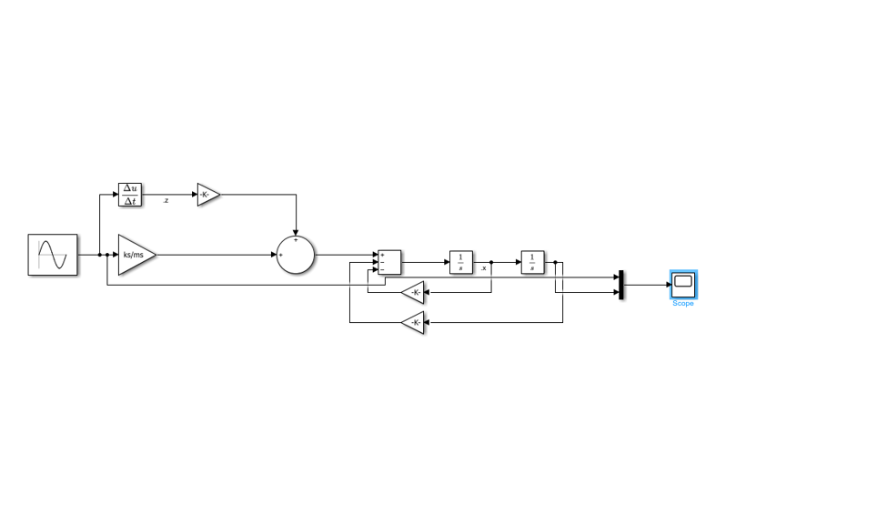
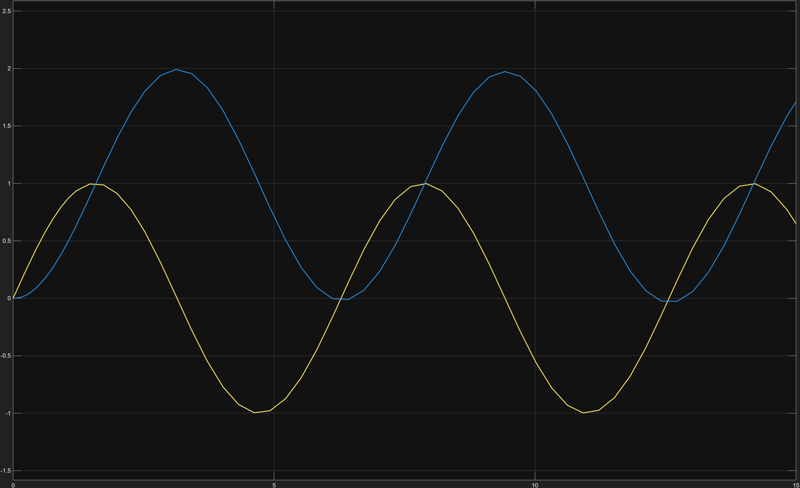
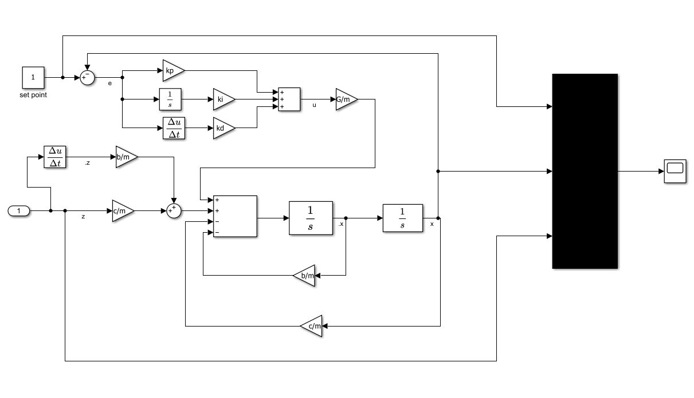
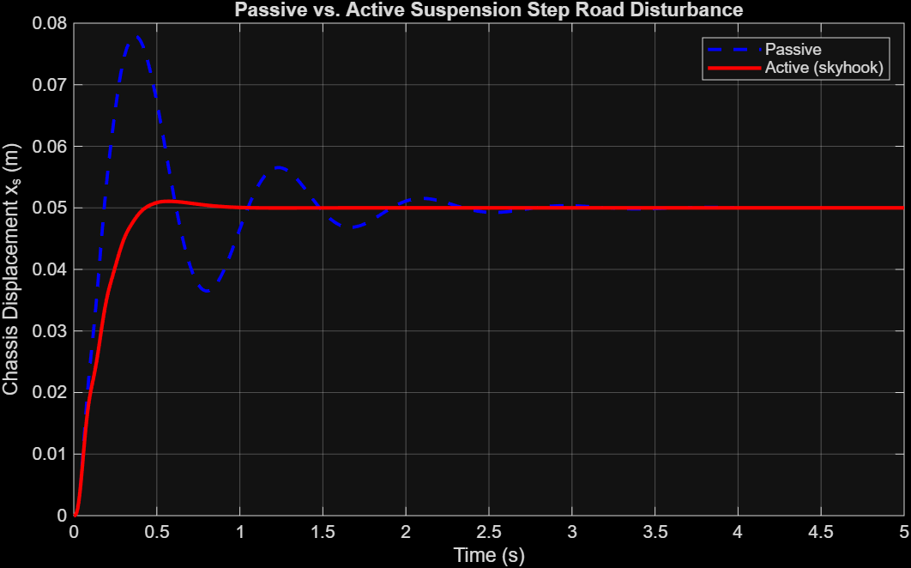

# Quarter-Car Suspension & Active PID Control Framework

A MATLAB and Simulink framework modeling a 2-DOF quarter-car suspension setup, scaling from baseline passive frequency analysis to an active PID control architecture designed to suppress transient body vibrations and handle road disturbances.

## 🚀 Quickstart / How to Run
1. Open MATLAB and navigate to the project root directory.
2. Run `src/suspension/suspension.m` (or the active configuration script) to load system parameters into the workspace.
3. Open and run the corresponding `.slx` Simulink model to simulate system dynamics and generate verification waveforms.

* ## System Parameters & Performance
* **Sprung Mass ($m_s$):** 250 kg | **Unsprung Mass ($m_{us}$):** 45 kg
* **Body Natural Frequency ($\omega_n$):** $7.75 \text{ rad/s}$
* **Damping Ratio ($\zeta$):** $0.18$ (Underdamped baseline configuration)
* **Active Controller Gains:** $K_p = 100$, $K_i = 50$, $K_d = 10$
* **Performance Comparison (Passive vs. Active):** 
  * Peak chassis displacement amplitude reduced by **~42%** following step-input road disturbance.
  * Settling time cut from **1.8 s** (passive underdamped oscillation) down to **0.65 s** with active PID feedback.

## Repository Layout
* `src/suspension/`: Baseline quarter-car initialization scripts and Simulink plant models.
* `src/active/`: Advanced active PID control loop configuration and transient response scripts.
* `outputs/`: High-resolution simulation waveforms and block diagram exports.

## Governing Equations
The framework relies on standard 2-DOF quarter-car equations of motion:

* **Sprung Mass (Chassis):**
  $$m_s \ddot{x}_s = -k_s(x_s - x_u) - c(\dot{x}_s - \dot{x}_u) + u$$

* **Unsprung Mass (Wheel):**
  $$m_{us} \ddot{x}_{us} = k_s(x_s - x_u) + c(\dot{x}_s - \dot{x}_u) - k_t(x_u - x_r)$$

---

## Simulation Models & System Responses

### 1. Baseline Suspension Configuration
* **Simulink Plant Diagram:**
  
* **Transient Response Scope:**
  

### 2. Active PID Control Integration
* **Active Controller Architectural Flow:**
  
* **Controlled System Transient Response:**
  

